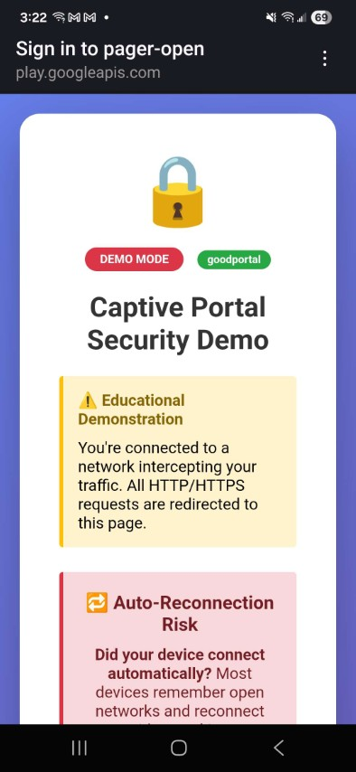
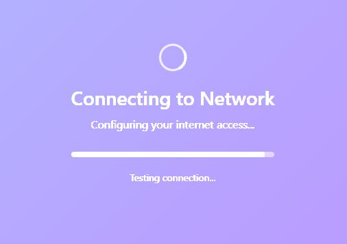

# GoodPortal Configure

Configure and start a captive portal on LAN interfaces for the WiFi Pineapple Pager.

## Description

This payload sets up a captive portal with minimal configuration required. It's designed for educational demonstrations and authorized red team engagements.

## Features

- Automatic nginx package installation if missing
- PHP support (php8-fpm installed if missing and portal contains PHP files)
- Compatible with EvilPortals collection
- Automatic credential logging to `/root/loot/goodportal/`
- Client whitelisting after credential capture
- Alert notifications when credentials are captured
- Additional payloads available: 
  - [GoodPortal Clear Whitelist](../goodportal_clear_whitelist)
  - [GoodPortal Remove](../goodportal_remove)

## Usage

1. Run the payload from the Pager interface
2. Select a portal (if multiple are available)
3. The captive portal will start automatically on LAN interfaces

Change portals by re-running the payload and selecting a different portal directory.

## Custom Portals

Save custom portal directories to `/www/goodportal/{portal_name}`. Portals from [EvilPortals](https://github.com/kleo/evilportals) work out of the box with this setup - including credential capture to the pager's loot directory.  You will have the option to install the full EvilPortals collection during payload execution.

## Pager Behavior

### Persistence
- **Firewall Rules**: Firewall redirect rules persist after reboot and must be manually removed using the [GoodPortal Remove](../goodportal_remove) payload or reconfigured.
- **Services**: nginx, php-fpm, DNS hijacking, and whitelist monitoring processes do not persist across reboots and must be restarted by re-running the payload.
- **Whitelists**: Client whitelists stored in `/tmp/` are cleared on reboot.
- **Design Philosophy**: All changes are designed to be reversible to ensure a clean system state.

### Credential Capture & Whitelisting
- When credentials are captured through the portal, they are logged to `/root/loot/goodportal/credentials_YYYY-MM-DD_HH-MM-SS.log`
- Clients are automatically whitelisted after submitting credentials, allowing them to bypass the captive portal and access the internet
- An alert notification is sent when new credentials are captured
- After whitelisting, clients are redirected to an endless loading page until internet access through the pager is fully working.

### Related Payloads
- **GoodPortal Clear Whitelist**: Clears all whitelisted MAC addresses, forcing all clients back to the captive portal. Restarts the firewall to remove temporary bypass rules.
- **GoodPortal Remove**: Completely removes the captive portal configuration, stops all services (nginx, php-fpm, DNS hijacking, whitelist monitor), removes firewall rules, and restores the original nginx configuration from backup.

## Credits

spencershepard (GRIMM) - message me on the Hak5 Discord!

## Changelog
- 1.1
  - Initial release
- 1.2 
  - Added additional http firewall redirect rule
  - Fixed 'opkg update &&' chaining issue
  - Fixed Name -> Title metadata
  - Added warning about internet blocking on LAN (necessary for captive portal functionality)
  - Added installation option for pre-built Evil Portals collection (github.com/kleo/evilportals)
  - Redirect page after credential capture now waits for internet access instead of fixed delay (with fake progress bar)
  - Whitelist now uses IP addresses instead of MAC addresses